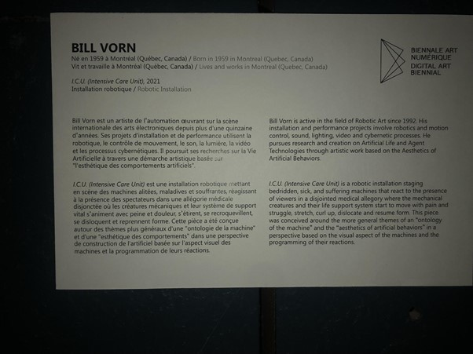

## Titre de l'oeuvre ou de la réalisation
I.C.U. (Intensive Care Unit)
## Nom de l'artiste 
Bill Vorn
## Année de réalisation
2021
## Nom de l'exposition ou de l'événement
Imagine Monet
## Lieu de mise en exposition
Arsenal art contemporain, Montreal
## Date de votre visite
Mercredi 9 février 2021
## Description de l'oeuvre 
I.C.U. (Intensive Care Unit) est une installation robotique mettant en scène des machines alitées, maladives et souffrantes, réagissant à la présence des spectateurs dans une allégorie médicale disjonctée où les créatures mécaniques et leur système de support vital s'animent avec peine et douleur, s'étirent, se recroquevillent, se disloquent et reprennent forme. Cette pièce a été conçue autour des thèmes plus généraux d'une "ontologie de la machine" et d'une "esthétique de comportement" dans une perspective de construction de l'artificiel basée sur l'aspect visuel des machines et la programmation de leurs réactions.

Ce texte est directement tiré du cartel de l'oeuvre.

## Explications sur la mise en espace de l'oeuvre ou du dispositif
Pour mettre en place cette oeuvre, il faut un endroit ou une pièce d'environ 10 mètres par 15 mètres en terme de longueur et de largeur.
Il doit aussi y avoir une certaine hauteur pour pouvoir installer la structure de barres métalliques qui sert à faire tenir les squelettes ainsi que le rectangle de lumière en l'air à l'aide de câbles.
Cette structure a aussi les projecteur et haut-parleur qui sont fixé dessus.
Des rideaux noirs doivent faire le tour de la pièce et recouvrir la totalité des murs.
Le rectangle de lumière doit être suspendu à un mètre au dessus du squelette.
Le dispositif de support vital doit être situé derrière le squelette, à moins d'un mètre.
Tout les fils électriques utilisé doivent être caché avec du ruban adhésif noir.
L'ordinateur qui controle l'oeuvre doit être caché et non visible.
Il y a 4 ensembles dans cette qui comporte chacun un squelette, un système de support vital ainsi que un rectangle de lumière.
Ils doivent tous être distancé les uns des autres et l'ensemble doit être disposé comme dans les photos suivantes:
## Liste des composantes et techniques de l'oeuvre ou du dispositif (ex. : réalité virtuelle, projecteurs, caméra USB, anneau lumineux...)

- Système de support vital comportant;

  - Un écran qui indique les signaux vitaux

  - Un boitier avec des boutons, roulettes, prises pour controller le système de support vital

  - Deux boitier rectangulaires où tout les tuyau d'air sont branchés

  - Un boitier où est branché le masque d'oxygène

  - Le tout est supporté par la base d'une chaise de bureau à roulette

- Un squelette robotique 

- Des tuyaux transparents qui projette de l'aire dans les articulations du quelette robotique lui permettant de bouger

- Un rectangle de lumières led

- Des hauts-parleurs

- Un masque d'oxygène reliant le squelette et le système vital

- Des projecteurs

- Des rideaux noirs fesant le tour de la pièce
## Liste des éléments nécessaires pour la mise en exposition (ex. : crochets, sac de sable, câbles de soutien...)

-Des multiprise

-Des cables de soutiens 

-Un ordinateur et tout l'ensemble pour le faire fonctionner

-Le logiciel controllant l'oeuvre

-une structure de barres de métale
## Expérience vécue :
## Description de votre expérience de l'oeuvre ou du dispositif, de l'interactivité, des gestes à poser, etc.
## ❤️ Ce qui vous a plu, vous a donné des idées et justifications
## 🤔 Aspect que vous ne souhaiteriez pas retenir pour vos propres créations ou que vous feriez autrement et justifications
## Références
