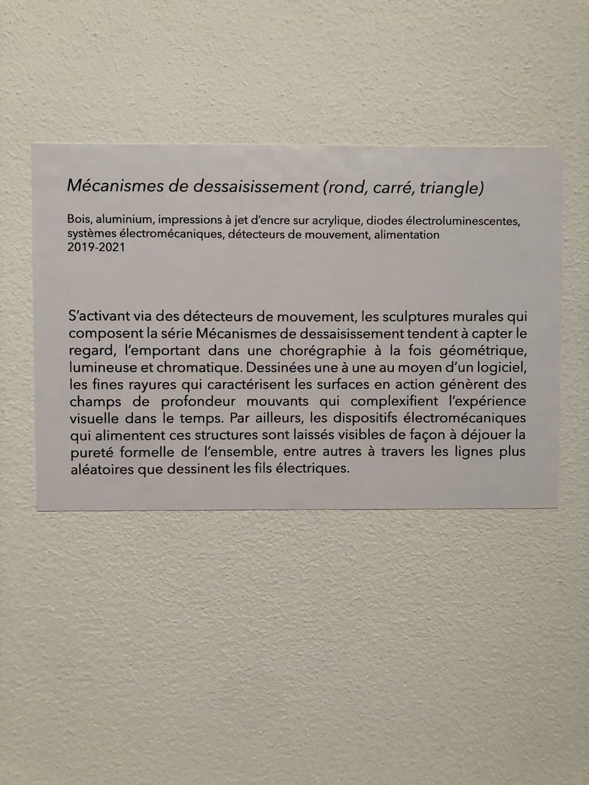
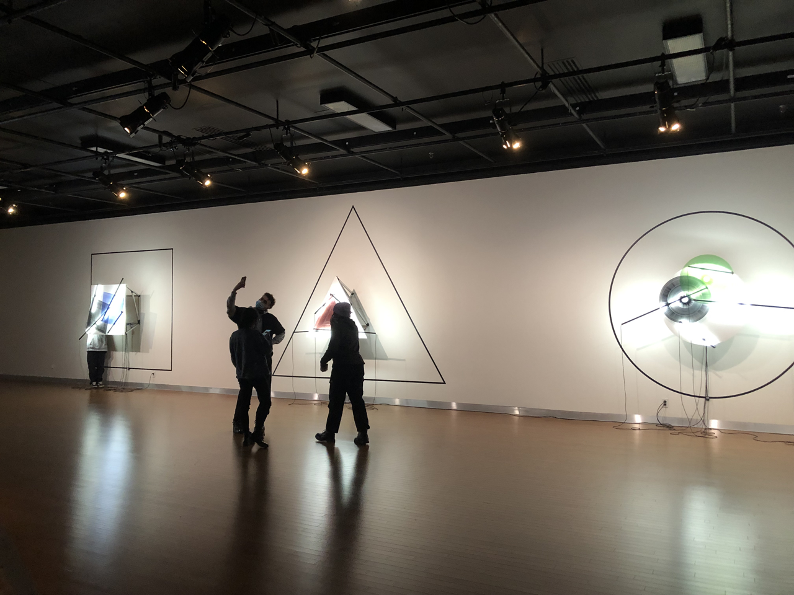
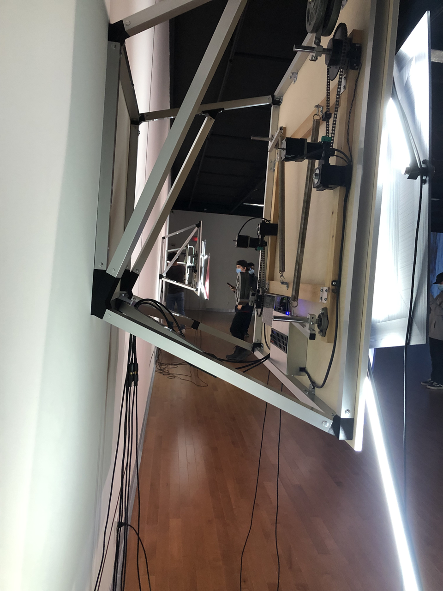
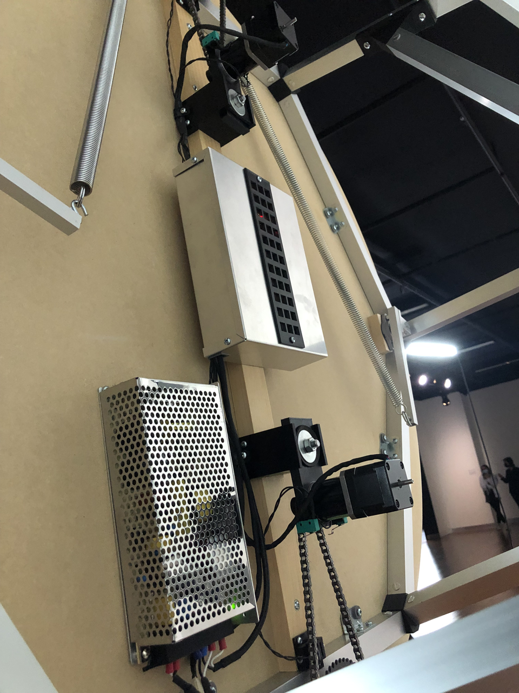
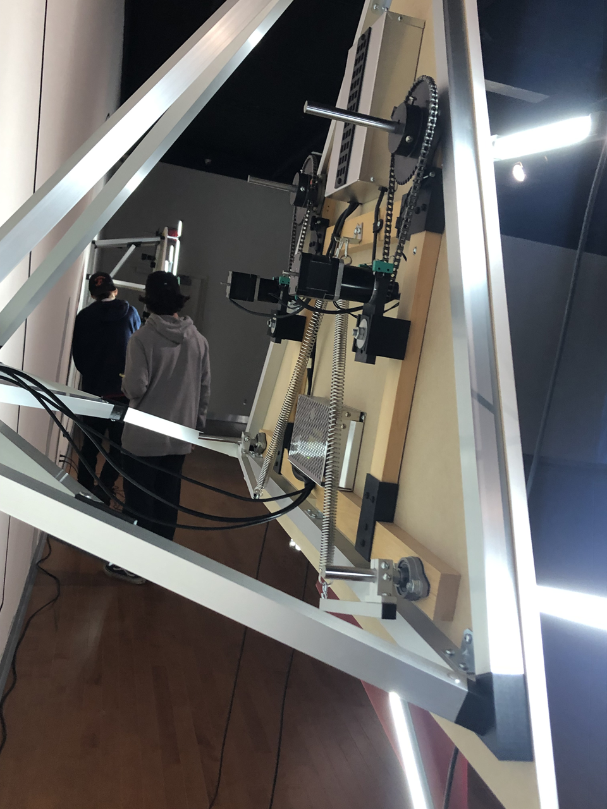

## Titre de l'oeuvre ou de la réalisation
Mécanismes de déssaisissement (rond,carré,triangle)
## Nom de l'artiste
Béchard Hudon
## Année de réalisation
2019-2021
## Nom de l'exposition ou de l'événement
Configuration du sensible
## Lieu de mise en exposition
Maison des arts de Laval
## Date de votre visite
16 Mars 2022
## Description de l'oeuvre ou du dispositif multimédia
S'activant via des détecteurs ded mouvement, les sculptures murales qui composent la série Mécanismes de déssaisissement tendent à capter le regard, l'emportant dans une chorégraphie à la fois géométrique, lumineuse et chromatique. Dessinées une à une au moyen d'un logiciel, les fines ayures qui caractérisent les surfaces en action génèrent des champs de profondeur mouvants qui complexifient l'expérience visuelle dans le temps. Par ailleurs, les dispositifs électromécaniques qui alimentent ces structures sont laissés visibles de façon à déjouer la pureté formelle de l'ensemble, entre autres à travers les lignes plus aléatoires que dessinent les fils électriques.

Ce texte est directement tiré du cartel de l'oeuvre.

## Explications sur la mise en espace de l'oeuvre ou du dispositif (texte à composer)

Afin de mettre en place cette oeuvre, il doit y avoir un long mur blanc pour pouvoir exposer les trois structures et pour qu'elles ne soient pas trop rapprochées les unes des autres. Les structures doivent êtrent disposées comme dans la photo ci-dessous:

Dans cette photo, on peut aussi voir qu'il est nécessaire qu'il y ai des barres métalliques au plafond pour pouvoir y installer les projecteurs. Les projecteurs doivent êtrent dirigés vers l'oeuvre.
Ensuite, il faut tracer en noir la forme des structures sur le mur comme sur la photo.
Sur le mur, juste en bas de l'endroit où les structures sont placées, il doit y avoir une prise électrique en bas de chaque structure.
Il est aussi important que les fils électrique soient visible et qu'ils soient lousse comme dans la photo ci-dessus.

Tout les composantes électroniques qui font fonctionner le mécanisme de l'oeuvre doivent êtrent derrière la structure comme dans les photos ci-dessous:

## Liste des composantes et techniques de l'oeuvre ou du dispositif (ex. : réalité virtuelle, projecteurs, caméra USB, anneau lumineux...)
- 9 projecteurs

- 3 prises électriques

- Les trois structures (carré, cercle, triangle) qui sont chacune composées de;

  - une plaque de fond de la forme requise (carré,cercle ou triangle) qui est plus grande que les deux autres.
 
  - Deux plaques de la forme requise, une noir et une de la couleur requise (rouge, vert ou bleu).
 
  - 4 barres métalliques qui font bouger les deux petites plaques.

  - Une structure de barre métallique qui soutient l'oeuvre.

  - Les fils électriques nécessaire pour chaque oeuvre.

  - Les composantes électroniques et mécaniques (que je ne peut pas décrire) qui sont sur la photo ci-dessous:
  

## Liste des éléments nécessaires pour la mise en exposition (ex. : crochets, sac de sable, câbles de soutien...)
- Une structure de barre métallique qui soutient les projecteurs
- Un long mur blanc
## Expérience vécue :
## Description de votre expérience de l'oeuvre ou du dispositif, de l'interactivité, des gestes à poser, etc.
## ❤️ Ce qui vous a plu, vous a donné des idées et justifications
## 🤔 Aspect que vous ne souhaiteriez pas retenir pour vos propres créations ou que vous feriez autrement et justifications
## Références
